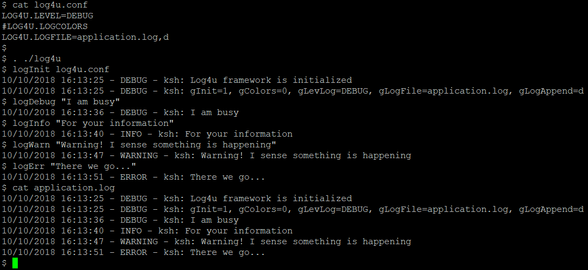
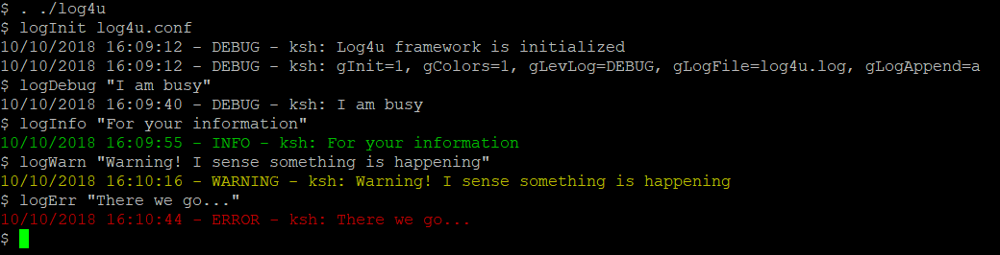

# LOG4U
Logging library for Unix.
## Installation
All you need is the log4u module. Optionally, write your own configuration file
## Usage
1. Source the log4u module:
```
    . ./log4u
```

2. If you have a config file, initialize it:
```
    logInit logging.conf
```
3. Use the logging functions logDebug, logInfo, logWarn, logError, logFail



Colors are also supported, by enabling the corresponding property in the 
configuration file.



## Contributing
You are welcome to extend/improve the library.

