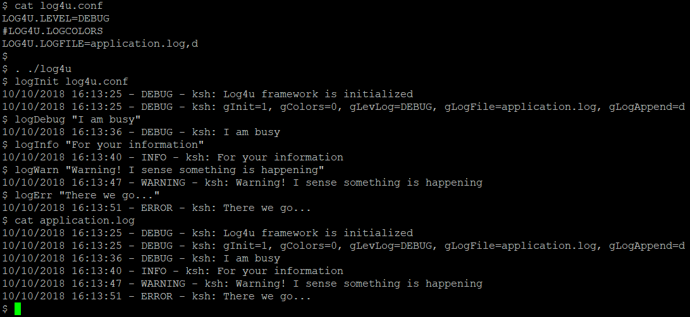
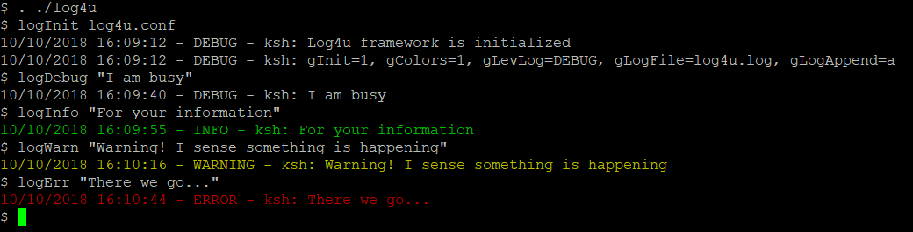

# LOG4U

[](https://github.com/edimatt/log4u/actions/workflows/ci.yml)

Logging library for POSIX-compatible shell scripts. The purpose of this library
is to provide a simple interface for logging in Unix scripts.

Functionalities:
1. logging levels
2. message colors
3. console and file writer (append and replace)

## Installation
All you need is the log4u module. Optionally, write your own configuration file

### Manual

The [log4u(7) manual](man/log4u.7) is the complete quick reference, including
the API, configuration properties, return codes, output format, and copy-ready
examples. View it locally with:

```sh
man ./man/log4u.7
```

### Compatibility

Log4u targets the POSIX `sh` language and does not require Bash- or
KornShell-specific features. It is tested with a POSIX shell; Bash and ksh can
also source it in their POSIX-compatible modes.

## Usage
1. Source the log4u module:
```
    . ./log4u
```

2. Write a configuration file (optional). Supported properties are
- LOG4U.CONSOLE
- LOG4U.CONSOLE.LEVEL=DEBUG|INFO|WARN|ERROR|FAIL
- LOG4U.LOGCOLORS
- LOG4U.LOGFILE=filename,[d|a]
- LOG4U.LOGFILE.LEVEL=DEBUG|INFO|WARN|ERROR|FAIL

LOG4U.CONSOLE, if present, enables the messages to go to the console. The
LOG4U.CONSOLE.LEVEL specifies the corresponding level (default INFO). 

LOG4U.LOGFILE specifies the log file name and mode with an optional flag ('d'
for delete and 'a' for append). If this property is specified, the
associated LOG4U.LOGFILE.LEVEL sets the corresponding level.
Levels can be different for file and console.

The property LOG4U.LOGCOLORS enables colors.

Configuration keys are case-sensitive. Blank lines and lines beginning with
`#` are ignored, and surrounding whitespace around keys and values is allowed.
If a key occurs more than once, its last value is used. Unknown keys and invalid
values cause `logInit` to return a nonzero status without changing the active
logging configuration.

Configuration is optional. Immediately after the library is sourced, console
logging is enabled at `INFO` level, colors are disabled, and file logging is
disabled. `logReset` restores these defaults. `logInit` may be called repeatedly;
successful calls replace the active configuration, while failed calls preserve
it. Logging functions return zero when all enabled outputs succeed and nonzero
when an output cannot be written.

3. If you have a configuration file, initialize the logging library:
```
    log4u_init logging.conf
```
4. Write log messages:
```sh
log4u_debug "request payload:" "$payload"
log4u_info "service started"
log4u_warn "retrying connection"
log4u_error "request failed"
log4u_fail "service cannot continue"
```

All arguments passed to a logging function are joined with a single space.
Warnings, errors, and failures are written to standard error; debug and
informational messages are written to standard output. Enabled file output
receives every message that passes its independent level threshold.

Console and file levels can be inspected and changed at runtime:
```sh
log4u_set_console_level WARN
log4u_set_file_level DEBUG
log4u_get_console_level
log4u_get_file_level
```

Setters accept exactly one of `DEBUG`, `INFO`, `WARN`, `ERROR`, or `FAIL`.
Invalid input returns status `2` and leaves the current level unchanged.

The remaining public functions are `log4u_reset` and `log4u_status`. All
implementation functions and state use the `_log4u_` prefix to avoid collisions
with the caller's shell environment. The original camel-case functions remain
available as backward-compatible aliases.

## Log format

Each entry starts with a local ISO 8601 timestamp including the UTC offset,
followed by the process ID, level, script name, and message:
```text
2026-07-30T14:30:00+0200 [12345] INFO ./example.sh: service started
```

Multiline messages are preserved verbatim. Only the first physical line carries
the metadata prefix; subsequent lines are continuation lines. ANSI colors apply
only to console output and are reset after every entry.



Colors are also supported, by enabling the corresponding property in the
configuration file.



## Contributing

The behavioral test suite uses
[bats-core](https://github.com/bats-core/bats-core). After installing Bats, run:

```sh
bats test
```

Every push and pull request runs ShellCheck and the Bats suite in parallel.

The suite covers configuration validation, level filtering, stdout/stderr
routing, file modes, colors, formatting, output failures, compatibility aliases,
and execution in the available POSIX-compatible shells.

Contributions and improvements are welcome.
